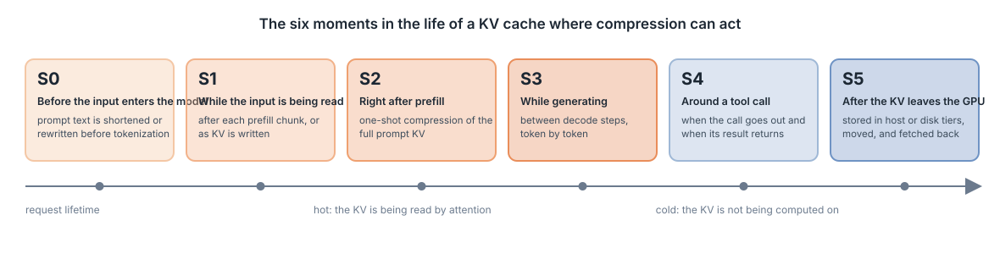
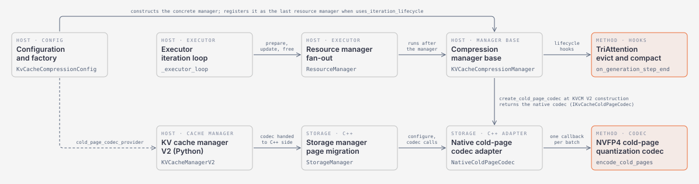
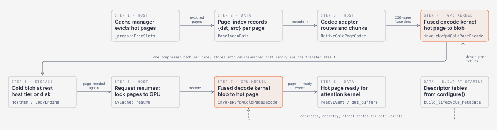
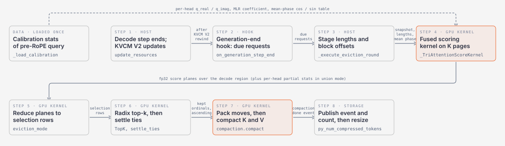
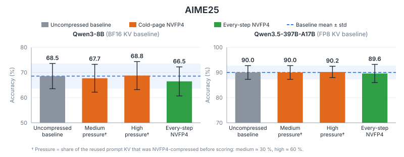
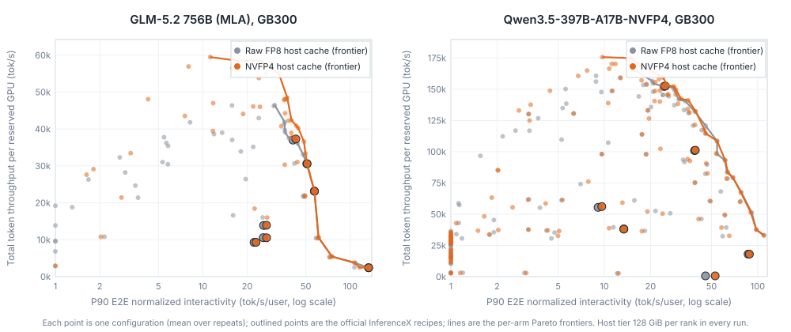

# KV Cache Compression in TensorRT LLM

**Table of Contents**
- [Introduction and Motivation](#introduction-and-motivation)
- [Overview of KV Cache Compression in TensorRT LLM](#overview-of-kv-cache-compression-in-tensorrt-llm)
- [KV Cache Compression Framework Design](#kv-cache-compression-framework-design)
  - [Design Philosophy](#design-philosophy)
  - [Architecture Overview](#architecture-overview)
  - [Hooks Between Forward Steps](#hooks-between-forward-steps)
  - [Encoding Pages That Leave the GPU: The Cold-Page Codec Contract](#encoding-pages-that-leave-the-gpu-the-cold-page-codec-contract)
  - [Configuration and Ownership](#configuration-and-ownership)
- [Algorithm Implementations](#algorithm-implementations)
  - [NVFP4 Cold-Page Quantization](#nvfp4-cold-page-quantization)
  - [TriAttention](#triattention)
- [Evaluation](#evaluation)
  - [NVFP4 Cold-Page Quantization](#nvfp4-cold-page-quantization-1)
  - [TriAttention](#triattention-1)
- [Summary and Future Work](#summary-and-future-work)
  - [Current State](#current-state)
  - [Future Work](#future-work)

## Introduction and Motivation

The tasks handed to Large Language Models (LLMs) keep getting more complex and more expensive to serve: models grow, the text they read and write grows with them, and nowhere is this more visible than in agentic workflows, where a model works through a task in many steps instead of one reply. An agent job is a chain of model calls separated by tool calls, and each tool result is appended to one growing conversation. Input length grows turn by turn, tool calls repeat dozens of times per job, and most of every prompt is text the system has already seen. For example, in the [InferenceX](https://inferencex.semianalysis.com/) AgentX coding traces the median input length per request is 14.4k tokens and over 96% of the prompt tokens are reusable prefix.

This pressure grows while the space for the KV cache does not: GPU memory is fixed, and the DRAM behind it is finite too. When the KV cache no longer fits, the consequences are severe. The most direct one is failing to serve: requests cannot be admitted until memory frees up. The next is slow serving, as the system spends its time evicting and refilling cache instead of computing. And in agentic workloads especially, a shortage of storage means missing the opportunity to reuse KV: a prefix that was computed a moment ago is gone when the next turn arrives, so it is computed again, and that extra computation is paid on almost every turn of the job. Serving such workloads well therefore means keeping as much of that KV as possible for as long as it is useful, at a cost the deployment can afford.

These characteristics create three opportunities that KV cache compression addresses directly:

- **The KV cache volume keeps growing.** Long prompts, dozens of requests per job, and many concurrent jobs produce far more KV than any GPU can hold, and the same prefix pages are requested again and again. Compressing the stored KV itself is the most direct way to keep more of it.
- **Serving already relies on host and disk tiers.** Prefixes that do not fit on the GPU are kept in host memory or on disk and moved back on the next turn. Compression lets those tiers hold more pages for the same capacity and moves fewer bytes across the GPU, host, and disk boundaries.
- **Every model runs agentic workloads.** Dense, MoE, MLA, and hybrid models all face the same pressure, so a method tied to one attention layout or one KV data type helps only one deployment. Compression applied at the level of KV cache pages, independent of the model's kernels, covers them all.

A wide range of KV cache compression methods have been proposed, from prompt compression and token eviction to low-precision storage, and TensorRT LLM already applies some of them inside the model: the active KV cache can be quantized, and the [sparse attention framework](blog17_Sparse_Attention_in_TensorRT-LLM.md) lets the attention kernel read only part of the cache. This blog is about the other places where compression can act: between prefill chunks, between decoding steps, around tool calls, and after the KV has left the GPU for host or disk memory. Two things set our approach apart. First, we introduce concrete methods that compress the KV cache at these points successfully, with accuracy and serving results to back them. Second, and more importantly, the framework treats all of these points the same way: each moment in the life of a KV cache where compression can run is exposed as a well-defined attachment point, a method plugs into the points it needs, and the rest of the serving stack is untouched. This is what makes the framework apply to any model, and it is also what lets future methods be added by plugging into an existing point rather than by modifying the serving loop or the attention kernels.

On this framework, TensorRT LLM currently ships two methods:

- **[NVFP4 cold-page quantization](https://github.com/NVIDIA/TensorRT-LLM/blob/main/docs/source/features/kv-cache-compression.md#cold-page-quantization)**: keeps attention KV pages in NVFP4 only while they are cold, that is, while a page has left the GPU for host or disk memory. The conversion runs as part of the copy itself, and the page is restored to its original precision when it comes back to the GPU.
- **[TriAttention](https://arxiv.org/abs/2604.04921)**: a training-free method that periodically scores the tokens generated so far and evicts the least useful ones between decoding steps once a sequence exceeds its token budget.

In the following sections, we first provide an overview of the KV cache compression capabilities in TensorRT LLM, then describe the framework design that makes them possible, walk through how each method is implemented on top of it, and finally present evaluation results.

## Overview of KV Cache Compression in TensorRT LLM

A key challenge in deploying KV cache compression at scale is the diversity of existing methods: they differ in **when they run** (between forward steps vs. when a page moves between memory tiers), in **what they change** (which tokens are kept vs. how the kept values are stored), and in the **cache layouts** they can handle (conventional MHA/GQA pages, MLA latent KV, and hybrid models that mix attention layers with recurrent state). To handle this diversity without special cases in the scheduler or the cache manager, TensorRT LLM introduces a **unified, extensible KV cache compression framework**. It has one configuration entry, one common foundation that every method builds on, and two plug-in points. Hooks run between forward steps; an encoder/decoder pair runs whenever a page moves between the GPU and host or disk memory. The cache manager keeps full ownership of pages, allocating them, moving them between tiers, and reusing them; a compression method only transforms their contents.

<figure>
  
</figure>

<em>Figure 1: Six stages in the life of a KV cache where compression can run. The two methods in this blog act at stage 4 and stage 6.</em>

To demonstrate the framework's generality, we have integrated two methods, one for each plug-in point:

*   **NVFP4 cold-page quantization**: converts attention KV pages to NVFP4 as they are written to host or disk memory and converts them back on the way to the GPU; the GPU cache and the attention kernels keep the model's normal KV data type (FP16, BF16, or FP8).
*   **TriAttention**: runs between decoding steps, scores the generated tokens with an importance measure calibrated offline for each attention head, and compacts the cache down to a fixed token budget while leaving the prompt intact.

The following tables summarize the current coverage:

| Method | When It Runs | What It Changes | Supported Attention Types |
| :--- | :--- | :--- | :--- |
| **NVFP4 cold-page quantization** | When a page moves between the GPU and host or disk memory | How attention KV is stored while off the GPU | MHA / MQA / GQA; MLA; hybrid models that mix attention with recurrent layers such as Gated DeltaNet (GDN) or state-space model (SSM) layers (only the attention KV is quantized) |
| **TriAttention** | Periodically during generation | Which KV tokens are kept | MHA / MQA / GQA |

| Memory Tier | NVFP4 Cold-Page Quantization | TriAttention |
| :--- | :--- | :--- |
| **GPU (active KV)** | Unchanged (FP16 / BF16 / FP8) | Generated tokens evicted periodically; prompt kept |
| **Host memory** | NVFP4 (4-bit values with FP8 block scales) | Not affected |
| **Disk** | Same NVFP4 data as host memory, copied as is | Not affected |

**Note**: Today, both methods require the PyTorch backend, the KV cache manager selected by `use_kv_cache_manager_v2: true`, and an NVIDIA Blackwell GPU (SM100 or SM103, for example B200 or GB300). The results in this blog were measured on GB300 systems; the cold-page feature was also validated functionally on B200.

This blog focuses on the **framework-level** design that is common across methods and on the NVFP4 cold-page implementation as the main worked example. For the low-level C++ interface between the cache manager and a cold-page encoder, including how pages are staged and moved between tiers, please refer to the [cold-page codec design guide](https://github.com/NVIDIA/TensorRT-LLM/blob/main/docs/source/developer-guide/kv-cache-cold-page-codec.md); for the APIs used to add a new method, please refer to the [KV Cache Compression Development Guide](https://github.com/NVIDIA/TensorRT-LLM/blob/main/docs/source/developer-guide/kv-cache-compression-development.md).

## KV Cache Compression Framework Design

The KV cache compression framework in TensorRT LLM gives different methods a common runway while hiding the complexity from users. A developer adds a new method by implementing one of two small contracts, hooks that run between forward steps or an encoder/decoder pair that runs when pages move between memory tiers, without touching the attention kernels, the cache manager's allocation and migration logic, or the serving loop.

### Design Philosophy

A compression method is selected with one configuration block, `kv_cache_compression_config`. It is deliberately separate from the KV cache configuration (capacity, memory tiers, block reuse, the data type of the active cache) and from the sparse attention configuration (how attention computes). One method can be active per LLM instance, and a method must either handle every cache layout it is given or pass the parts it does not understand through unchanged.

Every method in this framework follows the same three moves:

- **Observe** the KV cache at a moment when nothing is reading it: after a forward step, or when the cache manager is about to move a page to another tier.
- **Transform** it: drop tokens and compact the remaining ones, or re-encode a page into a smaller representation.
- **Hand it back**: report the new cache length, or return the encoded bytes to the cache manager so that the next reader sees a valid page.

The framework turns this pattern into two contracts. Methods that act between forward steps implement lifecycle hooks (listed below). Methods that act when pages leave or return to the GPU implement a page encoder and decoder. Two rules hold for both. First, compression stays outside the attention kernel: attention always reads the normal GPU representation and never sees the compressed form. Second, the cache manager remains in charge of pages: it allocates them, moves them between tiers, reuses them, and orders the copies. A method decides what to transform and how; it never decides where bytes live.

### Architecture Overview

At a system level the framework has three parts:

- A **compression manager** that receives the executor's hooks or the cache manager's migration requests and turns them into method-specific actions.
- A **transform kernel**, either a selection-and-compaction kernel for methods that drop tokens, or an encode/decode kernel for methods that re-encode pages, launched on the stream the framework supplies.
- The **cache manager**, which keeps ownership of pages and migration, so that compressed and uncompressed pages flow through the same paths.

From the user's side all of this is driven by `kv_cache_compression_config`. When it is present, a factory validates the requested combination and builds the concrete manager before the model runs or any page moves.

<figure>
  
</figure>

<em>Figure 2: The KV cache compression framework: one configuration and factory, one manager base, and two entry points, the executor's iteration cycle for hook-based methods such as TriAttention (top row) and the cache manager's page migration for page codecs such as NVFP4 quantization (bottom row).</em>

Figure 2 follows the two entry points. A hook-based manager is registered with the executor and runs after the cache manager has updated its own state at each step. A page-codec manager is built before the cache manager, because the cache manager needs to know the compressed page size to lay out its host and disk tiers. A method may use either path or both, but the two stay separate: eviction policy does not belong in a migration, and a page codec never allocates or publishes pages.

### Hooks Between Forward Steps

While a prefill or decode step runs, attention reads a fixed view of the KV cache. Between two steps that view can change, and that is where the hooks fire. A method overrides only the hooks it needs; all of them do nothing by default.

| Hook | When it fires | Typical work |
| :--- | :--- | :--- |
| `on_request_init` | Before a request's first prefill chunk | Set up per-request state |
| `on_context_step_end` | After a request's last prefill chunk | Compress the finished prompt before generation starts |
| `on_generation_step_begin` | Before each decode step | Prepare a compression action for this step |
| `on_generation_step_end` | After each decode step, once the cache has been updated | Compress the cache before the next step reads it |
| `on_request_finish` | When a request completes or is aborted | Release per-request state |

The hooks ride on the executor's existing request cycle; the framework wires them up. Methods on this path change which tokens are kept or how they are arranged in the paged cache. Two obligations come with it: the policy that chooses tokens stays separate from the shared compaction kernel, and a method must finish its GPU work before it shrinks or frees any cache pages. TriAttention, described below, is the shipped example. It uses the generation-end hook and leaves scheduling, prompt-prefix reuse, and the attention kernel unchanged.

### Encoding Pages That Leave the GPU

The second contract runs when the cache manager moves pages between tiers. On the way out, a GPU page is encoded into its compressed form as it is copied to host or disk memory; on the way back, the compressed page is decoded into the normal GPU representation before anything reads it. Figure 3 follows one page out and back with the NVFP4 codec described later; the cache-manager steps are the same for any codec.

<figure>
  
</figure>

<em>Figure 3: One page leaving and returning to the GPU with the NVFP4 codec: the cache manager evicts pages and hands a batch of page indices to the codec, the fused encode kernel writes one compressed page into host memory, and when the request resumes the fused decode kernel restores the page in its original data type before attention reads it.</em>

A GPU page may consist of several buffers (K and V, or an MLA latent buffer plus an index buffer, or the mixed buffers of a hybrid model), while a compressed page is one fixed-size block of bytes. The codec converts between the two, and four properties keep it simple:

- **Fixed compressed size.** Each layer group has one compressed page size, so every tier can address pages as base plus slot times size with a plain allocator.
- **Batched calls.** The cache manager hands the codec a whole batch of page indices (destination and source per page) with a stream, rather than one page at a time.
- **Asynchronous by design.** Encode and decode only enqueue GPU work on that stream; the cache manager tracks completion and owns the events, so the codec inherits the same ordering and failure handling as an ordinary copy.
- **Compressed pages stay compressed between tiers.** Host-to-disk and disk-to-host moves copy the bytes as they are; only the GPU boundary runs the codec.

Compression is optional at this layer: the default codec simply packs the page buffers into the block at full size. A compressing codec produces a smaller block through the same path and can mark some buffers as lossless, so recurrent-state buffers of hybrid models or side buffers such as an MLA index pass through unchanged inside the same page. Adding a new format means adding a kernel and its layout description; tier routing, staging, batching, and ordering are shared. The C++ interface and the Python provider API are documented in the [cold-page codec design guide](https://github.com/NVIDIA/TensorRT-LLM/blob/main/docs/source/developer-guide/kv-cache-cold-page-codec.md).

### Configuration and Ownership

Because the framework spans the executor, the cache manager, and native kernels, its most important decision is who owns what:

- The **configuration and factory** own method selection and compatibility checks. An unsupported combination is rejected before anything is built; nothing falls back silently at run time.
- The **compression manager** owns the method's cadence, its per-request state, its format metadata, and its kernel launches.
- The **cache manager** owns pages, tiers, migration, reuse, and the ordering of copies.
- The **attention backend** owns the active GPU representation it reads, and nothing else.

Configuration is opt-in and small. Cold-page quantization is turned on with `algorithm: quantization_for_cold_page` and `quant: nvfp4` under `kv_cache_compression_config`, together with a host tier (`host_cache_size`, optionally `disk_cache_size` and `disk_cache_path`) under `kv_cache_config`; the active cache keeps its normal data type. TriAttention is turned on with `algorithm: triattention` plus `budget`, `beta`, `eviction_mode`, and `calibration_path`. The same fields work in the Python API, in `trtllm-serve` YAML, and in `trtllm-bench`. Calibration files and other offline artifacts are inputs, not work: the runtime validates them at start-up and fails fast if they are missing or incompatible. The full option table is in the [KV Cache Compression feature documentation](https://github.com/NVIDIA/TensorRT-LLM/blob/main/docs/source/features/kv-cache-compression.md).

## Algorithm Implementations

In this section, we walk through the two KV cache compression methods currently implemented in TensorRT LLM, focusing on how each method works and how it integrates with the framework. For a quick-start guide and runnable configurations, please refer to the [KV cache compression examples](https://github.com/NVIDIA/TensorRT-LLM/tree/main/examples/kv_cache_compression).

### NVFP4 Cold-Page Quantization

#### Introduction

NVFP4 is a 4-bit floating-point format (E2M1) in which every group of 16 values shares one FP8 (E4M3) block scale, optionally combined with a per-tensor global scale. TensorRT LLM already uses it for NVFP4 weights and for the NVFP4 active KV cache, so its rounding behavior and conversion kernels are well established. Cold-page quantization applies the same format at a different point in the system: instead of keeping the *active* KV cache in NVFP4 and asking the attention kernel to read it, it keeps attention KV in NVFP4 **only while a page is in host or disk memory**. The GPU cache and the attention kernels keep the model's normal KV data type (FP16, BF16, or FP8).

Host and disk memory are the right place for this transform for three reasons. In a reuse-heavy deployment the quantities that bind are the bytes *stored* off the GPU and the bytes *moved* over PCIe and storage links, so a smaller page buys more retained pages per gigabyte and fewer bytes per transfer. Because the active KV is never quantized, no error accumulates step after step, and a page that never leaves the GPU is never touched. And the transform is invisible to everything above it: page identity, token identity, block reuse, scheduling, and the GPU layout that attention sees are unchanged.

The arithmetic is simple. Packed E2M1 data plus one E4M3 scale per 16 values costs 0.5625 bytes per value, against 2 bytes for FP16 or BF16 and 1 byte for FP8. After the alignment the layout imposes, the measured page sizes are:

- **Models with FP8 active KV**: 43.75% fewer bytes per attention page off the GPU (Qwen3.5-397B-A17B 1,048,576 -> 589,824 B; Qwen3-8B with FP8 KV 2,359,296 -> 1,327,104 B), that is 1.78x more pages per byte of host or disk memory.
- **MLA latent pages (GLM-5.2)**: 41.1% fewer bytes (3,098,112 -> 1,824,000 B), or 1.70x; the ratio is lower because the index buffer in the same page is kept lossless.
- **Models with BF16 active KV**: 71.9% fewer bytes (Qwen3-8B with BF16 KV 4,718,592 -> 1,327,104 B), or 3.56x.

These figures are for attention KV. The recurrent-state buffers of hybrid models (Gated DeltaNet, state-space, and convolution state) are stored as they are and do not shrink.

#### How It Works in TensorRT LLM

Within TensorRT LLM, NVFP4 cold-page quantization is a compression manager that plugs into the page-codec path of the framework. Below we highlight the key design choices in layout, kernels, scales, and verification.

**Layout policy.** Enabling `quantization_for_cold_page` with `quant: nvfp4` selects the manager, which is built before the cache manager because the cache manager needs the compressed page size to lay out its host and disk tiers. At start-up the manager receives the description of every GPU page buffer once and builds a layout table per layer group: for MHA, MQA, and GQA pages the K and V buffers become NVFP4 data plus block scales; for MLA pages the latent attention key is encoded; side buffers in the same page, such as the index buffer of a sparse-attention model, are appended as they are; and the recurrent-state buffers of hybrid models are routed to the default lossless path. For DeepSeek-V4, the part of the attention history without positional encoding is encoded as NVFP4 while the positional part and the remaining specialized state are kept losslessly in the same page. A GPU page may span several buffers in the normal KV type; the compressed page is one fixed-size block: the packed NVFP4 spans, then their E4M3 block scales, then the lossless spans, each 16-byte aligned.

**Fused encode and decode kernels.** Encoding and transfer are one operation. The offload kernel reads the GPU page, quantizes it, and writes the packed page straight into the mapped host slot; the onboard kernel reads the compressed page from host memory, dequantizes it, and writes the full-precision page into the GPU pool. Each launch takes the layout table, a batch of page indices, the destination base address, and the stream the cache manager supplies, with no per-page host work. There is **no model-specific kernel**: the same launcher covers MHA, GQA, MQA, MLA, and the DeepSeek-V4 layout, driven entirely by the layout table; adding DeepSeek-V4 support meant a new layout policy and its CUDA operator, with no change to the cache manager or to the shared codec path. Host and disk share the encoded bytes, so moving a page to disk never re-quantizes it.

**Scales and calibration.** By default the codec uses identity global scales, so a regular FP16, BF16, or FP8 checkpoint needs no calibration step; the block scale for each group of 16 values is computed during encode and stored with the page. A compatible NVIDIA ModelOpt NVFP4 checkpoint can optionally supply per-layer K and V global scales through `scale_checkpoint_path`; this applies to the K/V layout, while MLA pages and draft-model pages use identity scales. Weight quantization and KV compression are independent: a checkpoint with NVFP4 weights and FP8 active KV uses this feature as usual, and a model whose active KV is already NVFP4 is moved losslessly. Target and draft caches are both covered, so one-model MTP-EAGLE and EAGLE3 speculative decoding work with the codec enabled.

**Verifying that it is active.** A parsed configuration does not prove that any page was compressed, because a short request may never leave the GPU. The feature therefore exposes two counters on the `/metrics` endpoint, `trtllm_kv_cache_offload_bytes_total` and `trtllm_kv_cache_onboard_bytes_total`, which become nonzero only when pages cross a tier boundary. Because the counters count every migration, including lossless ones, a profiler trace is the definitive check: with the codec enabled, Nsight Systems shows the fused offload and onboard kernels on the timeline, and every page read back from host memory has a matching encode and decode. All accuracy and serving results in this blog were gated on this check. Functional coverage includes Qwen3 MHA and GQA models on the host and disk paths, Qwen3.5 with one-model MTP (target and draft caches), one-model EAGLE3 on host and disk, and an MLA model with FP8 active KV under pipeline parallelism.

The concrete implementation can be found in `tensorrt_llm/_torch/kv_cache_compression/` (the manager and layout policy), `cpp/tensorrt_llm/batch_manager/kv_cache_compression/` (the native codec path), `cpp/tensorrt_llm/kernels/nvfp4ColdPageKernels.cu` (the fused encode and decode kernels), and `cpp/tensorrt_llm/nanobind/kvCacheCompression/bindings.cpp` (the Python-to-native bridge).

### TriAttention

#### Introduction

[TriAttention](https://arxiv.org/abs/2604.04921) (ICML 2026) is a training-free KV cache eviction method for long generations. During decoding it periodically scores the cached tokens with a trigonometric importance measure derived from per-head query statistics collected offline, keeps the most important `budget` tokens, and physically compacts the cache, so that more sequences fit on a GPU at once. The prompt is always preserved; only generated tokens are evicted. For technical details, please refer to the paper and to the official implementation at [github.com/WeianMao/triattention](https://github.com/WeianMao/triattention).

#### How It Works in TensorRT LLM

TriAttention is a compression manager on the hook path that overrides the generation-end hook. Every `beta` confirmed generation tokens, once a sequence exceeds its budget, the manager scores the evictable generated tokens with CuTe DSL and Triton kernels, selects the `budget` tokens to keep according to `eviction_mode` (`union`, `per_head`, or `per_layer_perhead`), and compacts the paged KV cache in place with a native CUDA kernel. A speculative step may confirm several tokens at once; crossing more than one eviction period in one step is coalesced into one eviction. The calibration file (each head's mean and magnitude of the pre-RoPE query, produced by the official tool) is loaded and converted once when the manager is created. Figure 4 follows one eviction round from the hook to the compacted cache.

<figure>
  
</figure>

<em>Figure 4: TriAttention between two decode steps: the generation-end hook picks the due requests, a fused CuTe DSL kernel scores the generated tokens from calibration statistics, the scores are reduced per eviction mode and selected with a radix top-k, and a native compaction kernel moves K and V in place before the manager reports the new cache length and returns the freed pages.</em>

The method changes the physical cache length but keeps block reuse valid, because it compacts only the generated suffix and preserves the prompt prefix that the cache manager reuses. There is no sparse-attention configuration and no custom attention backend; decoding runs the model's standard attention kernel over the compacted cache. For calibration, configuration parameters, and current requirements, please refer to the [TriAttention example](https://github.com/NVIDIA/TensorRT-LLM/blob/main/examples/kv_cache_compression/triattention.md).

## Evaluation

This section consolidates accuracy and performance results for the KV cache compression methods supported in TensorRT LLM. All comparisons are against TensorRT LLM's own uncompressed configuration on the same hardware, wheel, and recipe; only the compression setting changes between arms.

### NVFP4 Cold-Page Quantization

Unless otherwise specified, the experiments below use GB300 GPUs, the PyTorch backend, native C++ KVCM V2, and block reuse enabled. "NVFP4" denotes the arm with cold-page NVFP4 enabled; the uncompressed arm's KV type and host tier are stated in each subsection. The accuracy runs are gated on nonzero offload and onboard page counts inside the scored window. The serving campaigns export no per-run migration counters; codec activation for the GLM-5.2 serving wheel is verified by a separate profiler probe on the same wheel, and the Qwen3.5-397B-A17B serving wheel has not been probed.

#### Accuracy

We evaluate accuracy on AIME25 with 16 seeds per arm, using each model's official sampling configuration (Qwen3.5-397B-A17B: 64,000 output tokens, temperature 0.6, top-p 0.95, top-k 20; Qwen3-8B: 38,912 output tokens). The protocol forces a controlled share of the reused prompt KV through the codec before scoring: prompts are first served to populate the cache, the GPU tier is flushed so that the pages are offloaded and compressed, and the scoring pass replays the prompts, onboarding and decoding the compressed pages. Decode KV is never compressed. "Medium" and "high" pressure correspond to roughly 28% and 61% of the reused prompt KV pages being NVFP4-compressed for Qwen3.5-397B-A17B, and approximately 30% and 60% for Qwen3-8B. Qwen3.5-397B-A17B runs NVFP4 weights with FP8 KV on four GB300 (TP=4, one engine); Qwen3-8B runs BF16 KV on one GB300. The baseline is the same model with all KV on the GPU in its runtime KV type (FP8 for Qwen3.5-397B-A17B, BF16 for Qwen3-8B) and no host tier.

| Model | Dataset | Uncompressed Baseline (runtime KV type) | Cold-Page NVFP4 (medium) | Cold-Page NVFP4 (high) |
| ------------------ | ------------------ | --------------------------------------- | ------------------------ | ---------------------- |
| Qwen3.5-397B-A17B | AIME25 (16 seeds) | 90.0 | 90.0 | 90.2 |
| Qwen3-8B | AIME25 (16 seeds) | 68.5 | 67.7 | 68.8 |

<figure>
  
</figure>

<em>Figure 5: AIME25 accuracy over 16 seeds for Qwen3-8B (left) and Qwen3.5-397B-A17B (right): uncompressed baseline, cold-page NVFP4 at medium and high pressure, and an every-step NVFP4 control that quantizes the live KV after each forward step. The band is the baseline mean plus or minus one standard deviation. The series labeled "All-NVFP4 KV cache" is the emulated every-step control described in the text, not the active NVFP4 KV cache feature; the figure footnote rounds both models' pressure shares to 30% and 60%.</em>

Compared with the uncompressed baseline, no significant degradation is observed in the tested scope. The paired deltas are +0.00 pp (medium) and +0.21 pp (high) for Qwen3.5-397B-A17B, with standard errors of 0.68 and 0.57 pp, and -0.83 pp (medium) and +0.21 pp (high) for Qwen3-8B, with a standard error of 1.39 pp; all four are within one standard error of zero. Figure 5 also includes a directional control that quantizes the *live* KV to NVFP4 after every forward step: its deltas are -2.08 pp for Qwen3-8B and -0.42 pp for Qwen3.5-397B-A17B, inside seed noise at n=16 but consistently below the cold-page arms. Because no native FP4-KV decode kernel exists for these head sizes on the tested release, this control is a Torch quantize-dequantize emulation rather than a native kernel result, and we report it as directional only.

#### Performance

We benchmark NVFP4 cold pages against the uncompressed host tier on two models: GLM-5.2 (756B, MLA attention) and Qwen3.5-397B-A17B (hybrid attention plus GDN, NVFP4 weights). The workload is a 3,600-second replay of the InferenceX-derived AgentX 256k agentic trace, which has heavy prefix reuse across turns; these runs reuse the public trace and recipes but are not an official InferenceX submission. "Raw" denotes the uncompressed arm, whose host tier stores pages in FP8, the runtime KV type of both models. We sweep the published InferenceX recipes and a large set of derived configurations (concurrency, prefill/decode split, and GPU count) so that both arms are measured on the same grid: 54 matched configurations and 218 accepted runs (two repeats per arm) for GLM-5.2 on 8 to 48 GB300, and 131 matched configurations and 330 accepted runs (mostly single-repeat) for Qwen3.5-397B-A17B on 3 to 60 GB300. The host tier is 128 GiB per prefill rank in every run. We report **total token throughput per reserved GPU** against **P90 end-to-end normalized interactivity** (tokens per second per user, higher is better), the Pareto view in Figure 6.

<figure>
  
</figure>

<em>Figure 6: Throughput per reserved GB300 versus P90 interactivity for the uncompressed (Raw FP8) and NVFP4 host caches on GLM-5.2 (left) and Qwen3.5-397B-A17B (right). Each point is one configuration averaged over repeats; outlined points are the official InferenceX recipes; lines are the per-arm Pareto frontiers.</em>

Figure 6 shows the throughput-interactivity Pareto frontiers for the two arms; curves further to the upper-right indicate better throughput at equivalent interactivity. On GLM-5.2 the NVFP4 frontier lies on or above the Raw frontier: it gains in the 30.7-51 tok/s/user band (median +12.1% over the 27 frontier vertices in the 30.7-133 overlap, maximum +28.5% at 36.1 tok/s/user) and coincides with Raw above roughly 51 tok/s/user, where both frontiers are formed by the same low-concurrency cells. Below 30.7 tok/s/user only NVFP4 has points, at 55,000 to 59,500 tok/s per GPU, and Raw has no tested point above 46,461 tok/s per GPU. On Qwen3.5-397B-A17B the two frontiers largely coincide, and NVFP4 separates from Raw only at the throughput-bound, low-interactivity end. We summarize the results using four metrics:

| Model | Workload | Peak Throughput/GPU Gain | Median Same-Config Gain | Cache-Read Hit Delta | TTFT p90 (median) |
| ------------------------------- | -------------------------- | ------------------------ | ----------------------- | -------------------------------------------------- | ----------------- |
| GLM-5.2 (MLA), 8-48 GB300 | AgentX 256k replay, 3600 s | +28.0% | +3.5% (54 configs) | +1.7 pp median (54 configs) | -32.5% (50 configs) |
| Qwen3.5-397B-A17B, 3-60 GB300 | AgentX 256k replay, 3600 s | n/a (single-repeat points; see text) | +0.9% (131 configs) | +0.3 pp median (131 configs) | -6.1% (131 configs) |

The +28.0% for GLM-5.2 is a frontier statement: the best NVFP4 point (24 GB300) against the best Raw point anywhere on the grid (also 24 GB300, at a different concurrency); the same +28.0% holds as the SLA-bounded best at P90 interactivity of at least 5 or 10 tok/s/user, and +25.8% at 25 tok/s/user. Across the 54 matched GLM-5.2 configurations the same-configuration medians are +3.5% in throughput per GPU and -32.5% in TTFT p90 (over the 50 configurations with TTFT p90 in both arms), with 25 of 54 configurations gaining more than 10%. For Qwen3.5-397B-A17B, the peak comparison (+6.0%, single-repeat points on 36 versus 28 GB300) and the SLA-bounded best (+5.4% at 10 tok/s/user) sit at the edge of the single-repeat noise band, so we report them as observations; the medians over 131 matched configurations (+0.9% throughput per GPU and -6.1% TTFT p90) are the representative figures.

To understand where the benefit comes from, it helps to look at the cache-read hit rate. The gain tracks how far the Raw arm's hit rate falls below the trace's prefix-reuse ceiling: where the uncompressed host tier holds the working set, both arms already reach cache-read hit rates of 93.6% to 97.9%, within about 3 pp of the ceiling (95.5% to 98.0%), and NVFP4 has nothing to recover; where the uncompressed tier thrashes, NVFP4 keeps more of the reusable prefix resident and throughput follows. On GLM-5.2 the correlation between the hit-rate delta and the per-GPU throughput gain over the 54 configurations is 0.959. The largest hit-rate delta, +34.2 pp (52.6% to 86.7%), comes from an under-provisioned 8-GPU cell where the Raw arm collapsed; it is one of 9 of the 54 configurations where Raw falls below half of the NVFP4 throughput, which we treat as robustness under pressure rather than as gains. At all 7 official InferenceX recipes for GLM-5.2 and all 6 for Qwen3.5-397B-A17B, NVFP4 is **neutral** (GLM-5.2 -0.27% to +0.84%, Qwen3.5 -0.48% to +1.13% throughput per GPU, within repeat noise), because those recipes are tuned so that the Raw host tier already holds the working set. Qwen3.5-397B-A17B stores its GDN state losslessly and its host tier is rarely the bottleneck at these recipes, which is why its medians are near zero.

Two qualifiers apply to every number above. The host tier is fixed at 128 GiB per prefill rank in all runs, so these campaigns measure what NVFP4 buys at a *given* host budget and make no claim about host memory saved at equal hit rate. And GPU counts differ across configurations, so peak comparisons mix compression and topology effects; the same-configuration medians do not.

### TriAttention

For TriAttention configuration, calibration workflow, validated modes, and evaluation, please refer to the [TriAttention example](https://github.com/NVIDIA/TensorRT-LLM/blob/main/examples/kv_cache_compression/triattention.md) and to [PR #16957](https://github.com/NVIDIA/TensorRT-LLM/pull/16957).

## Summary and Future Work

### Current State

TensorRT LLM now provides a **unified KV cache compression framework** that supports two methods across two complementary lifecycle levels:

- **Framework-level**: One configuration and factory path (`KvCacheCompressionConfig`), one manager base class (`KVCacheCompressionManager`), and two standardized contracts: five lifecycle hooks for iteration-driven methods and the KVCM V2 cold-page codec ABI (`IKvCacheColdPageCodec`, fixed-size cold pages, `PageIndexPair` batches, enqueue-only encode/decode) for storage-bound methods. The configuration is orthogonal to active KV quantization and sparse attention; KVCM V2 retains ownership of pages, migration, reuse, and mapping publication.
- **Method-level**: NVFP4 cold-page quantization ships with encode and decode fused into the transfer, one compressed representation shared by the host and disk tiers, lossless handling of non-attention and side-buffer state, optional ModelOpt global scales, and support for MHA/MQA/GQA, key-only MLA, and DeepSeek-V4 layouts (DeepSeek-V4 support is in the current tree; see the feature documentation); it has been tested with the Qwen3, Qwen3.5, GLM, DeepSeek-R1, and DeepSeek-V4 families. TriAttention demonstrates the iteration-driven path with budget-triggered eviction during generation; it has been tested with the Qwen3, GPT-OSS, and Llama 3 families. The framework and both methods landed upstream in [PR #16957](https://github.com/NVIDIA/TensorRT-LLM/pull/16957) (TriAttention), [PR #17512](https://github.com/NVIDIA/TensorRT-LLM/pull/17512) (cold-page codec support in KVCM V2), and [PR #18091](https://github.com/NVIDIA/TensorRT-LLM/pull/18091) (NVFP4 cold-page method).

A new compression method can be integrated by implementing one contract (hooks or codec) and its batched transform kernel, without modifying the attention kernels, the cache manager, or the serving infrastructure.

### Future Work

- **Higher-ratio cold-page formats**: The codec contract fixes only the cold-page size per lifecycle, so 2-bit and trellis-coded representations, as well as non-quantization codecs such as entropy coding or low-rank projection, can be added as new providers without changes to KVCM V2.
- **Native low-precision decode kernels**: No native FP4-KV decode kernel exists today for the head sizes used by the tested models, which is why the every-step control above is an emulation. Native kernels would allow active-KV quantization and cold-page compression to compose.
- **Host-tier sizing guidance**: A host-quota sweep at the official recipes, with exported migration counters, would turn the mechanism described above into deployment guidance.
- **Disaggregated serving co-design**: Cold-page compression covers the worker-local GPU-to-host and host-to-disk boundaries today, while the context-to-generation transfer moves the hot representation. Carrying the compressed representation across that link and into decode-side cold tiers is a natural extension.
- **More iteration-driven methods and hybrid-model state**: The five hooks are method-neutral; we expect further eviction and context-compression methods on them, and we are exploring a unified treatment of auxiliary and non-attention state so that hybrid models benefit beyond the attention share of their cache.
