# KV Cache Compression in TensorRT LLM

**Table of Contents**
- [Introduction and Motivation](#introduction-and-motivation)
- [Overview of KV Cache Compression in TensorRT LLM](#overview-of-kv-cache-compression-in-tensorrt-llm)
- [KV Cache Compression Framework Design](#kv-cache-compression-framework-design)
  - [Design Philosophy](#design-philosophy)
  - [Architecture Overview](#architecture-overview)
  - [Configuration and Integration with the Cache Manager](#configuration-and-integration-with-the-cache-manager)
  - [KV Cache Compression in the Executor Iteration Loop](#kv-cache-compression-in-the-executor-iteration-loop)
  - [KV Cache Compression in Cross-Request KV Management](#kv-cache-compression-in-cross-request-kv-management)
  - [Covering the Other Stages](#covering-the-other-stages)
- [Algorithm Implementations](#algorithm-implementations)
  - [NVFP4 Cold-Page Compression](#nvfp4-cold-page-compression)
  - [TriAttention](#triattention)
- [Evaluation](#evaluation)
  - [NVFP4 Cold-Page Compression](#nvfp4-cold-page-compression-1)
  - [TriAttention](#triattention-1)
- [Summary and Future Work](#summary-and-future-work)
  - [Current State](#current-state)
  - [Future Work](#future-work)

## Introduction and Motivation

The tasks handed to Large Language Models (LLMs) keep getting more complex and more expensive to serve. Models grow, the text they read and write grows with them, and nowhere is this more visible than in agentic workflows, where a model works through a task in many steps instead of one reply.

An agent job is a chain of model calls separated by tool calls, and each tool result is appended to one growing conversation. Input length grows turn by turn, tool calls repeat dozens of times per job, and most of every prompt is text the system has already seen.

In the [InferenceX](https://inferencex.semianalysis.com/) AgentX coding traces, for example, the median input length per request is 14.4k tokens and over 96% of the prompt tokens are reusable prefix. Our earlier blog on [evaluating agentic serving with trace replay](https://nvidia.github.io/TensorRT-LLM/blogs/tech_blog/blog27_Evaluating_Agentic_Serving_with_Trace_Replay_and_Job_Level_Metrics.html) characterizes these workloads and the role of KV cache reuse in detail. Figure 1 shows that the same shift is visible at the scale of a whole serving platform.

<figure>
  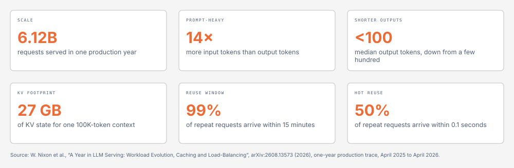
</figure>

<em>Figure 1: LLM serving today. On a one-year production trace, requests are prompt-heavy, outputs are getting shorter, a single long context carries tens of gigabytes of KV, and almost all reuse arrives within minutes. In agentic coding traces, almost the entire prompt is reusable prefix. Sources: <a href="https://arxiv.org/abs/2608.13573">Nixon et al., A Year in LLM Serving (2026)</a> for the first six tiles, and our <a href="https://nvidia.github.io/TensorRT-LLM/blogs/tech_blog/blog27_Evaluating_Agentic_Serving_with_Trace_Replay_and_Job_Level_Metrics.html">trace-replay blog</a> for the last one.</em>

This pressure grows while the space for the KV cache does not: GPU memory is fixed, and the DRAM behind it is finite too. When the KV cache no longer fits, the consequences are severe.

The most direct one is failing to serve: requests cannot be admitted until memory frees up. The next is slow serving, as the system spends its time evicting and refilling cache instead of computing. In agentic workloads especially, a shortage of storage means missing the opportunity to reuse KV: a prefix computed a moment ago is gone when the next turn arrives, so it is computed again, and that extra computation is paid on almost every turn of the job.

To serve these workloads well, a system has to keep more KV cache and keep it for longer, without adding memory. These characteristics create three opportunities that KV cache compression addresses directly:

- **The KV cache keeps growing.** Agent jobs produce far more KV than a GPU can hold, and the same prefix pages are needed again and again. Compressing the stored KV is the most direct way to keep more of it.
- **Serving already relies on host and disk tiers.** Prefixes that do not fit on the GPU are kept in host memory or on disk and brought back on the next turn. Compression lets those tiers hold more pages and moves fewer bytes between them.
- **All models face this pressure.** A method tied to one attention type or one KV data type helps only one deployment. Compression at the level of KV cache pages works for every model.

A wide range of KV cache compression methods have been proposed, from prompt compression and token eviction to low-precision storage, and TensorRT LLM already applies some of them inside the model: the active KV cache can be quantized, and the [sparse attention framework](blog17_Sparse_Attention_in_TensorRT-LLM.md) lets the attention kernel skip part of the cache, as used in DeepSeek-V3.2, GLM-5.2, and DeepSeek-V4. This blog is about the other places where compression can act: between prefill chunks, between decoding steps, around tool calls, and after the KV has left the GPU for host or disk memory.

Two things set our approach apart. First, we introduce concrete methods that compress the KV cache at these points successfully, with accuracy and serving results to back them. Second, and more importantly, the framework treats all of these points the same way: each moment in the life of a KV cache where compression can run is exposed as a well-defined attachment point, a method plugs into the points it needs, and the rest of the serving stack is untouched.

This is what makes the framework apply to any model, and it is also what lets future methods be added by plugging into an existing point rather than by modifying the serving loop or the attention kernels.

On this framework, TensorRT LLM currently ships two methods:

- **[NVFP4 cold-page compression](https://github.com/NVIDIA/TensorRT-LLM/blob/main/docs/source/features/kv-cache-compression.md#cold-page-quantization)**: keeps attention KV pages in NVFP4 only while they are cold, that is, while a page has left the GPU for host or disk memory. The conversion runs as part of the copy itself, and the page is restored to its original precision when it comes back to the GPU. On an agentic serving replay with a growing disk tier it completes up to 1.64x the requests with up to 1.9x lower average time to first token on the same hardware, and its accuracy cost is bounded by a single NVFP4 rounding that does not compound over repeated offloads.
- **[TriAttention](https://github.com/NVIDIA/TensorRT-LLM/blob/main/docs/source/features/kv-cache-compression.md#triattention)**: a training-free method that periodically scores the tokens generated so far and evicts the least useful ones between decoding steps once a sequence exceeds its token budget. On Qwen3-8B it delivers up to 1.6x the decode throughput at the same batch size and 2.7x the dense peak once the dense cache runs out of memory, while accuracy stays within noise of dense from an 8k-token budget on.

In the following sections, we first provide an overview of the KV cache compression capabilities in TensorRT LLM, then describe the framework design that makes them possible, walk through how each method is implemented on top of it, and finally present evaluation results.

## Overview of KV Cache Compression in TensorRT LLM

KV cache compression, as used in this blog, means shrinking the KV cache at any point in a workflow, however complex the workflow is. The goal is to cut KV cache pressure while keeping the information in the cache accurate.

Figure 2 shows where this sits in TensorRT LLM. It is one of three ways to cut memory and compute, next to quantization and sparse attention. It works on the KV pages that the cache manager owns.

<figure>
  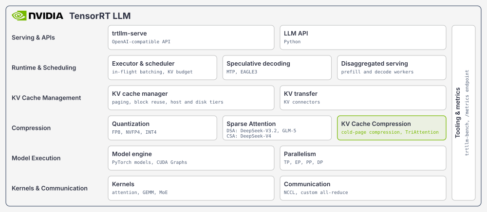
</figure>

<em>Figure 2: The TensorRT LLM stack. KV cache compression sits in the compression layer next to quantization and sparse attention. It changes what is stored in the KV cache and touches neither the kernels below nor the serving layers above.</em>

KV cache compression in TensorRT LLM covers the whole life of a KV cache, not only the gap between two forward steps. It can run during inference, after prefill and between decode steps. It can also run when the system moves KV around, for example when pages are offloaded or transferred, and after a request ends and its KV is kept for reuse. The result is one optimization for the whole serving system rather than for one kernel.

In detail, we define five stages in the life of a KV cache, shown in Figure 3: the prefill-chunk stage (stage 1), the after-prefill stage (stage 2), the decode stage (stage 3), the tool-call stage (stage 4), and the after-request stage (stage 5). Each stage is a moment when nothing is reading the cache, so compression can run there safely. Together the five stages cover every KV cache in the system, and they apply to any large language model.

<figure>
  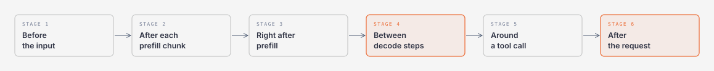
</figure>

<em>Figure 3: Five stages in the life of a KV cache where compression can run. TriAttention acts at the decode stage (stage 3) and cold-page compression at the after-request stage (stage 5). The dashed stages are in scope and have no method yet.</em>

Working in stages has two benefits. A method picks only the stages it needs, and a stage works the same way for every model.

We defined the stages this way so that the framework needs one small contract per kind of stage and nothing more. Stages inside a request are reached by compression in the executor iteration loop. Stages beyond a single request, where the KV cache is kept and managed across requests, are reached through the KV cache manager, for example when pages are offloaded and onboarded.

In both cases the cache manager keeps full ownership of pages. It allocates them, moves them between tiers, and reuses them. A compression method only changes their contents.

We have built two methods on the framework, using two of the five stages. NVFP4 cold-page compression works at the after-request stage (stage 5) and TriAttention at the decode stage (stage 3). The same framework lets us add methods at the other stages and support more complex algorithms in the future. The two methods are:

*   **NVFP4 cold-page compression**: stores attention KV pages as NVFP4 while they sit in host or disk memory. A page is converted on the way out and restored on the way back. The GPU cache and the attention kernels keep the model's normal KV data type.
*   **TriAttention**: runs between decoding steps. It scores the generated tokens with an importance measure calibrated offline for each attention head and keeps only a fixed budget of them. The prompt is never touched.

The two tables below summarize the current coverage.

| Method | When It Runs | What It Changes | Supported Attention Types |
| :--- | :--- | :--- | :--- |
| **NVFP4 cold-page compression** | After-request stage (stage 5): when a page moves between the GPU and host or disk memory | How attention KV is stored while off the GPU | multi-head, multi-query and grouped-query attention (MHA / MQA / GQA); multi-head latent attention (MLA); hybrid models (attention KV only) |
| **TriAttention** | Decode stage (stage 3): periodically between decode steps | Which KV tokens are kept | MHA / MQA / GQA |

<em>Table 1. The two methods built on the framework: the stage each one runs at, what it changes, and the attention types it supports.</em>

| Memory Tier | NVFP4 Cold-Page Compression | TriAttention |
| :--- | :--- | :--- |
| **GPU (active KV)** | Unchanged (FP16 / BF16 / FP8) | Generated tokens evicted periodically; prompt kept |
| **Host memory** | NVFP4 (4-bit values with FP8 block scales) | Not affected |
| **Disk** | Same NVFP4 data as host memory, copied as is | Not affected |

<em>Table 2. What each method does to the KV cache in each memory tier.</em>

**Note**: Currently, this design targets and is validated on NVIDIA Blackwell GPUs (B200 and GB300).

This blog covers the framework design shared by all methods, with NVFP4 cold-page compression as the main worked example. The C++ interface between the cache manager and a page encoder is documented in the [cold-page codec design guide](https://github.com/NVIDIA/TensorRT-LLM/blob/main/docs/source/developer-guide/kv-cache-cold-page-codec.md). The APIs for adding a new method are in the [KV Cache Compression Development Guide](https://github.com/NVIDIA/TensorRT-LLM/blob/main/docs/source/developer-guide/kv-cache-compression-development.md).

## KV Cache Compression Framework Design

TensorRT LLM provides a general framework for KV cache compression, built around two ideas. First, users turn on a compression method with one designated compression config and nothing else. Second, developers add a new compression method on top of the framework with plain Python and a just-in-time compiled kernel, without touching the runtime. The framework takes care of the rest: when a method runs, how it reaches the KV cache, and how the cache manager keeps control of memory. The sections below describe how this works.

### Design Philosophy

The design starts from one observation: compression does not need to live inside the model or the attention kernel. It only needs to run at the right moment, on the KV that is already there. This sets two conditions on the methods the framework serves. First, a method is not co-designed with the attention kernel: it changes what the cache holds, and attention reads the result as it reads any cache. Second, a method does not need a runtime tensor from the forward pass that is reading the cache, such as the query tensor of the running step; it decides from the stored KV itself, or from statistics it keeps on its own. Methods that break either condition, such as RocketKV, which scores KV with the current query, belong to the [sparse attention framework](blog17_Sparse_Attention_in_TensorRT-LLM.md), which catalogues and supports them; this blog does not cover that class. So the runtime pauses at a well-defined point, hands the KV cache to the compression method, and continues once the method returns. Compression is extra work inserted at the right points of the runtime, and the whole serving system benefits from the smaller cache.

Three principles follow from this.

- **Attention stays untouched.** Sparse attention changes how the attention kernel reads the cache. KV cache compression never does. Attention always reads the normal GPU representation, and a compressed page is restored before anything reads it.
- **Insertion is seamless.** A method plugs into the runtime without changes to the scheduler, the executor loop, or the model. It only changes the contents of KV pages. The cache manager keeps control of memory: it allocates pages, moves them between tiers, and reuses them.
- **Insertion points are well defined.** They follow the life of a request and of the server, the five stages of Figure 3: after each prefill chunk, right after prefill, between decode steps, around a tool call, and after the request. We call these points hooks, but the idea is simply a place in the runtime where a compression algorithm can be inserted and run to completion.

A compression method is selected with one configuration block, `kv_cache_compression_config`. It is kept separate from the KV cache configuration, which sets capacity, memory tiers, block reuse, and the active KV data type. It is also separate from the sparse attention configuration, which controls how attention computes. One method can be active per LLM instance. A method must handle every cache layout it is given, or pass the parts it does not understand through unchanged.

### Architecture Overview

The framework has three well-defined parts that together form KV cache compression in TensorRT LLM.

- **Compression config.** One configuration block collects everything the user asks for, validates it, and routes it to the concrete method. A factory then builds that method's manager before the model runs.
- **Compression manager base.** This base class is the core of the framework: it defines where in the runtime compression is injected. For a method that works between decode steps, such as TriAttention, the base provides the ability to run after every decode step. For a method that works on pages leaving the GPU, such as cold-page compression, the base hooks into the KV cache manager and adds compression to offloading and onboarding. A concrete method inherits the base and is injected at the matching points automatically.
- **Method-specific kernels.** Each method brings its own kernels that compress and decompress the KV cache. The architecture lets a method define a new series of such kernels, optimize them, and fuse them with neighboring kernels, for example with the copy that moves a page off the GPU.

The executor and the KV cache manager are existing components of TensorRT LLM. The framework does not replace them. It interacts with them at the insertion points and leaves scheduling and memory ownership where they are.

<figure>
  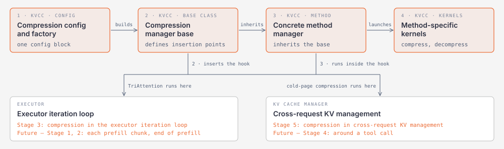
</figure>

<em>Figure 4: The KV cache compression framework and its execution order. The config builds the manager (1). The manager base inserts a hook into the executor and one into the KV cache manager (2). The concrete method inherits the base and runs inside those hooks (3), launching its own kernels (4). Highlighted boxes are the framework parts; white boxes are existing system components, with the stages each one hosts today and in the future.</em>

Figure 4 introduces the whole framework and how it follows the lifetime of a KV cache. The framework interacts with different parts of the TensorRT LLM runtime so that compression can be injected at the five stages defined above. The executor iteration loop hosts the stages inside a request: the prefill-chunk, after-prefill, and decode stages (stages 1 to 3). The KV cache manager hosts the stages beyond a single request: the tool-call and after-request stages (stages 4 and 5), when the KV cache is kept and managed across requests.

Some of these stages have a method today and some do not. The decode stage (stage 3) is implemented by TriAttention. The after-request stage (stage 5) is implemented in part by cold-page compression, which handles the pages that leave the GPU for host or disk memory. The rest of this section walks through the framework in detail: how a user configures it and which cache manager it works with, how each path works, and how the other stages will be covered.

### Configuration and Integration with the Cache Manager

Configuration is deliberately small. One block, `kv_cache_compression_config`, collects only the settings that belong to compression: which method to run and that method's own options. A factory validates the block, rejects unsupported combinations before anything is built, and hands the settings to the compression manager, which handles everything from there. Cold-page compression is turned on with `algorithm: quantization_for_cold_page` and `quant: nvfp4`. TriAttention is turned on with `algorithm: triattention` plus its budget and calibration options. The same fields work in the Python API, in `trtllm-serve` YAML, and in `trtllm-bench`. The full option table is in the [KV Cache Compression feature documentation](https://github.com/NVIDIA/TensorRT-LLM/blob/main/docs/source/features/kv-cache-compression.md).

The cache manager and the attention backend are outside the framework. The compression manager is designed to adapt to any cache manager and any attention backend. It changes only the contents of KV pages, and it never owns pages, tiers, or the kernels that read them.

The framework touches three existing parts of TensorRT LLM. The executor iteration loop hosts the in-request hooks. The KV cache manager, today KVCacheManagerV2 (V2 from here on), owns the pages, the host and disk tiers, and the migration of pages between them; the compression manager binds to it after it is built, and the cold-page codec plugs into its page migration path, so V2 keeps ownership of pools, mappings, and migration while the codec decides how a page is stored off the GPU. The attention backend is not touched at all. For the interfaces involved, see the [KV cache compression development guide](https://github.com/NVIDIA/TensorRT-LLM/blob/main/docs/source/developer-guide/kv-cache-compression-development.md).

### KV Cache Compression in the Executor Iteration Loop

This path serves the stages inside a request: the prefill-chunk stage (stage 1), the after-prefill stage (stage 2), and the decode stage (stage 3). Today the decode stage (stage 3) is the one with a shipped method. While a prefill or decode step runs, attention reads a fixed view of the KV cache. Between two steps that view can change, and that is where the hooks fire. A method overrides only the hooks it needs, and all of them do nothing by default.

The way in is simple. The executor already keeps a list of resource managers and calls every one of them at fixed points of each iteration: before the forward pass, after it, and when a request ends. The compression manager base inherits the same resource manager class and is registered as the last one in that list, so it runs after the KV cache manager has updated its state. Inside those three callbacks it fires the five hooks, as Figure 5 shows. A method inherits the base and overrides only the hooks it needs; **TriAttention** overrides the one after each decode step.

<figure>
  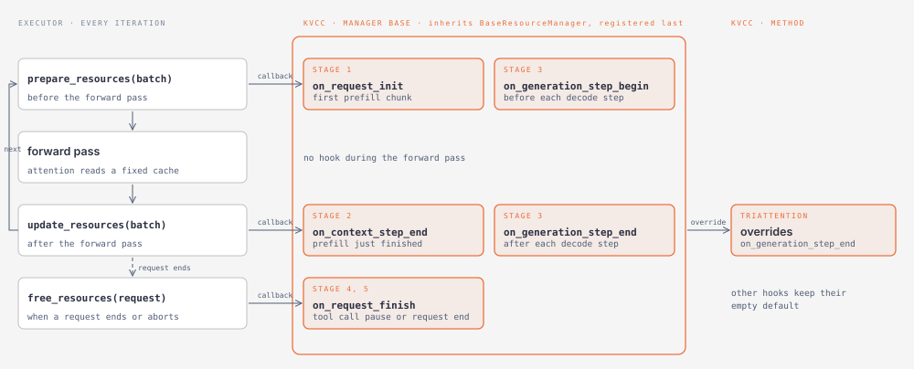
</figure>

<em>Figure 5: How the hooks reach the executor iteration loop. Every BaseResourceManager receives three callbacks per iteration: before the forward pass, after it, and when a request ends. KVCacheCompressionManager inherits BaseResourceManager and turns the three callbacks into the five hooks. A method overrides the hooks it needs.</em>

| Hook | When it fires | Stage it serves |
| :--- | :--- | :--- |
| `on_request_init` | Before a request's first prefill chunk | Prefill-chunk stage (stage 1), set-up before the first chunk |
| `on_context_step_end` | After a request's last prefill chunk | After-prefill stage (stage 2) |
| `on_generation_step_begin` | Before each decode step | Decode stage (stage 3) |
| `on_generation_step_end` | After each decode step, once the cache has been updated | Decode stage (stage 3) (used by **TriAttention**) |
| `on_request_finish` | When a request completes or is aborted | Tool-call and after-request stages (stages 4 and 5), when a request pauses or ends |

<em>Table 3. The five hooks in the executor iteration loop, when each one fires, and the stage it serves.</em>

We currently define these five hooks. **TriAttention** uses the generation-end hook, so the decode stage (stage 3) is the one exercised by a shipped method. The other hooks are already in place for the prefill-chunk and after-prefill stages (stages 1 and 2) and for the request-level events of the tool-call and after-request stages (stages 4 and 5), and a new method can use them without changes to the framework.

The hooks ride on the executor's existing request cycle, and the framework wires them up. Methods on this path change which tokens are kept or how they are arranged in the paged cache. Two obligations come with it. The policy that chooses tokens stays separate from the shared compaction kernel. And a method must finish its GPU work before it shrinks or frees any cache pages.

### KV Cache Compression in Cross-Request KV Management

Cross-request reuse means that the KV one request produces is kept and read again by a later request instead of being recomputed: the next turn of a conversation, the next step of an agent, or a request from another user that shares the same prefix. The benefit is direct. Every reused page is a prefill that never runs, so the fewer pages the tiers have to evict, the higher the cache hit rate and the lower the time to first token. Compression can help here. A smaller cold page means more pages fit in the host and disk tiers, so more prefixes are still there when the next request arrives and the hit rate improves. It is one lever among several, next to more host memory, a disk tier, or a different placement of requests, and it stacks with all of them. The framework brings compression to this path.

This path is the cross-request hook of the framework. It serves the stages outside a single request: the tool-call stage (stage 4), when a request pauses and its KV waits for the tool to return, and the after-request stage (stage 5), when a request has finished and its KV is kept for reuse, transferred to another worker, or offloaded to host or disk memory.

This whole period belongs to KVCacheManagerV2, introduced above. V2 decides which pages stay on the GPU, move to host or disk memory, are reused by a later request, or are transferred to another worker, and it does no compression itself. The framework therefore injects its compression management into V2 at the points where KV can be compressed: when pages are offloaded and onboarded, when they are transferred, and when a request ends. At each of these points a method's Python code and kernels can be plugged in, and V2 keeps working as before.

Today we cover the offloading part of the after-request stage (stage 5) with **NVFP4 cold-page compression**, enabled by `quantization_for_cold_page` with `quant: nvfp4`. It is a good example of how the framework interacts with V2. The storage path of V2 exposes two hook points, one when a page leaves the GPU and one when it returns. A codec plugged into these points encodes the page on the way out and decodes it on the way back, and the cache manager never sees the difference. How this works in detail, and how the NVFP4 codec is built, is described in the NVFP4 cold-page compression section below and in the [cold-page codec design guide](https://github.com/NVIDIA/TensorRT-LLM/blob/main/docs/source/developer-guide/kv-cache-cold-page-codec.md).

The remaining hook points of this path, the tool-call stage (stage 4) and the other events of the after-request stage (stage 5), are reserved for methods that need them. The same path could also carry KV across contexts that are similar but not identical, so that one cached block serves prompts that differ around it; KVCOMM is a published example, correcting a reused block with offsets estimated from online anchors so it is not prefilled again. Methods of that kind are future work and are not part of the framework today.

### Covering the Other Stages

Together, the two paths cover the decode stage (stage 3) and one part of the after-request stage (stage 5), which is what the two shipped methods need. The base class keeps the ability to define more hooks, so every stage that offers a compression opportunity can be reached the same way. How those hooks look is future work, and we will extend the framework as new methods need them.

## Algorithm Implementations

In this section, we walk through the two KV cache compression methods currently implemented in TensorRT LLM, focusing on how each method works and how it integrates with the framework. For a quick-start guide and runnable configurations, please refer to the [KV cache compression examples](https://github.com/NVIDIA/TensorRT-LLM/tree/main/examples/kv_cache_compression).

### NVFP4 Cold-Page Compression

#### Introduction

NVFP4 is NVIDIA's 4-bit floating-point format. Every value is stored in 4 bits (E2M1), and every group of 16 values shares one 8-bit (E4M3) scale, so a value costs 4.5 bits on average. TensorRT LLM already uses NVFP4 for model weights and for the active KV cache, so its numerics and conversion kernels are well established.

Cold-page compression applies this format at a different point in the system. Attention KV pages keep their normal data type, FP16, BF16, or FP8, while they are on the GPU. Only when a page leaves the GPU for host or disk memory is it converted to NVFP4, and it is converted back when it returns. The attention kernels never see the compressed form.

Host and disk offloading is a good place for compression for four reasons.

- **Friendly to accuracy.** Only pages that go cold are compressed, and a page goes cold only when the tier is under pressure. Everything else stays at full precision: the active cache, and every page that never leaves the GPU. In a normally provisioned deployment most pages are never compressed at all, and the ones that are carry one NVFP4 rounding rather than one per step. The accuracy impact is therefore smaller than compressing the whole cache, and far smaller than compressing it on every step.
- **Fused with the transfer.** The page has to be copied anyway. The encode happens inside that copy, so compression adds no separate pass over the data.
- **Less to move.** A smaller page means fewer bytes over PCIe and the storage link, so offloading and onboarding get faster as well as more capacity.
- **One payload per page.** The compressed page is a single fixed-size block with one base address per tier, instead of separate data and scale buffers. Storage tiers address it like any other page.

Figure 6 compares the three layouts of one KV page.

<figure>
  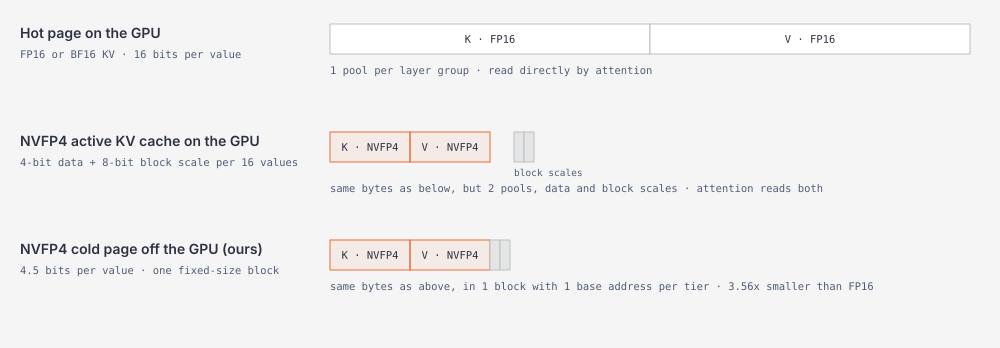
</figure>

<em>Figure 6: One KV page of one layer, holding K and V for 32 tokens, in three layouts. The hot page on the GPU stores 16 bits per value in one pool. The NVFP4 active KV cache and the NVFP4 cold page hold the same bytes, 4-bit data plus one 8-bit block scale per 16 values. The active cache keeps them in two pools that attention reads together; the cold page packs them into one fixed-size block with one base address.</em>

#### How It Works in TensorRT LLM

Within TensorRT LLM, NVFP4 cold-page compression is a compression manager on the cross-request KV management path, enabled with `algorithm: quantization_for_cold_page` and `quant: nvfp4`. Figure 7 follows one page out of the GPU and back.

**Encode, on the way out.** When the cache manager offloads pages, it hands the codec a batch of page indices and a stream. The codec launches `invokeNvfp4ColdPageEncode`, a fused kernel that reads the GPU pages, quantizes them, and writes the packed pages straight into the host slots, so quantization and transfer are one pass. The block scale of each group of 16 values is computed during the encode, so an FP16, BF16, or FP8 cache needs no calibration.

What gets quantized is decided once at start-up, from the buffers each layer keeps in its page. Only the attention K and V buffers are quantized, and for an MLA layer only the latent key buffer. Every other buffer in the page is copied as it is: the recurrent state of Gated DeltaNet and state-space layers, the convolution state, the index buffer of DeepSeek Sparse Attention, and the positional part of the DeepSeek-V4 cache. Everything that is not attention KV therefore stays lossless.

The result is one cold page per hot page: a single fixed-size block that holds the NVFP4 data, then the block scales, then the lossless buffers, each 16-byte aligned. Because the size is fixed per layer group, the host and disk tiers address cold pages as base plus slot times size, one copy moves a whole page instead of one copy per buffer, and moves between host and disk copy the bytes unchanged. This single-block layout is exactly what the cold-page codec support in KVCacheManagerV2 expects: V2 defines one cold-page size per lifecycle, calls the codec with batches of page indices, and treats encode and decode as asynchronous work on its own stream.

**Decode, on the way back.** When a request needs a page again, the cache manager onboards it and the codec launches `invokeNvfp4ColdPageDecode`, the fused counterpart that dequantizes the page and writes it in its original data type into the GPU pool before attention reads it. One launcher covers every layout, because the layout table drives the kernel. Target and draft caches are both covered, so speculative decoding works with the codec enabled.

**Kernel optimizations.** The point of fusing compression into the transfer is that the encode must not be slower than the plain copy it replaces. The kernels are therefore shaped like the cache manager's own mapped-host copy kernel, with the same thread-block (CTA) count and split policy, so compression rides the same bandwidth as a plain copy. Each CTA works on bounded tiles that always hold complete 16-value scale groups. It streams the GPU page in with a multi-stage 16-byte `cp.async` ring, four stages for GPU-resident input and eight for the slower mapped-host reads on the decode side, quantizes in shared memory with the packed values and scales staged together, and stores the result with 128-bit vector stores straight into the mapped host slot, so the store is the transfer. One launch covers up to 256 buffers and a whole batch of pages, and buffers marked lossless take a byte-exact vectorized copy in the same launch.

<figure>
  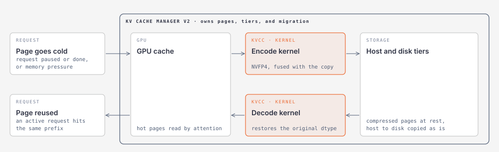
</figure>

<em>Figure 7: One page leaving and returning to the GPU inside the KV cache manager. A page goes cold when its request pauses or ends, or under memory pressure. A fused kernel quantizes the 16-bit hot page and copies it to the host and disk tiers as one 4.5-bit cold block in a single pass, and a fused decode kernel dequantizes and copies it back when an active request reuses it.</em>

The implementation lives in `tensorrt_llm/_torch/kv_cache_compression/quantization_for_cold_page/` (the manager and layout policy), `cpp/tensorrt_llm/batch_manager/kv_cache_compression/` (the native codec path), and `cpp/tensorrt_llm/kernels/nvfp4ColdPageKernels.cu` (the fused encode and decode kernels).

### TriAttention

#### Introduction

[TriAttention](https://arxiv.org/abs/2604.04921) (ICML 2026) is a training-free KV cache eviction method for long generations. Its observation is that the importance of a cached token to future queries can be predicted from statistics of the queries themselves, collected once offline for each attention head. During decoding, TriAttention periodically scores the generated tokens with a trigonometric importance measure built from these statistics, keeps the most important `budget` tokens, and physically compacts the cache, so that more sequences fit on a GPU at once. The prompt is always preserved; only generated tokens are evicted. Figure 8 shows one eviction round. For technical details, please refer to the paper and to the [TriAttention example](https://github.com/NVIDIA/TensorRT-LLM/blob/main/examples/kv_cache_compression/triattention.md) in TensorRT LLM.

<figure>
  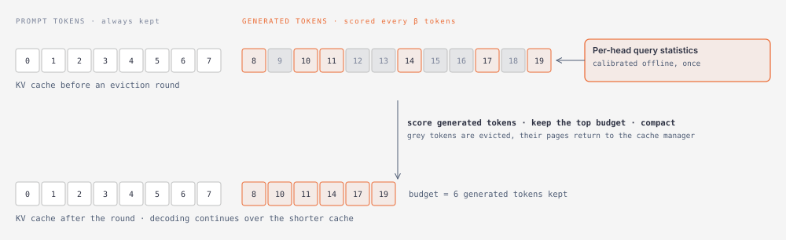
</figure>

<em>Figure 8: TriAttention keeps the prompt intact and evicts generated tokens. Every β new tokens, the generated tokens are scored with the calibrated query statistics of each head. The `budget` highest-scoring tokens stay, the rest are evicted, and the cache is compacted, so decoding continues over a shorter cache.</em>

#### How It Works in TensorRT LLM

**The algorithm.** TriAttention scores a cached token by how much attention future queries are expected to pay to it, without waiting for those queries. With rotary position embedding, the attention logit between a query and a key is a sum over frequency bands. Each band contributes the product of the query and key magnitudes in that band times the cosine of the rotation angle between them, and that angle grows with the distance between the two positions. Averaging the query over a calibration corpus replaces the unknown future query by each head's mean pre-RoPE query and its magnitude, the `E_q` and `E_q_norm` entries of the calibration file, together with the RoPE frequencies `omega`. The expected logit of a key then depends only on the key itself and on its position, and it can be evaluated from the K cache alone. This trigonometric expected logit is the importance score.

Every `beta` generated tokens, once a sequence is over its budget, TriAttention gathers the K cache of the generated tokens, computes this score for every token and head, normalizes the scores per head over the decode window, and keeps the `budget` tokens with the highest scores. In the default `union` mode each KV head nominates its top tokens and the union is re-ranked by each token's best score; `per_head` and `per_layer_perhead` keep separate sets per head. The prompt is never scored or evicted, and the kept tokens are compacted so that the cache physically shrinks.

**Kernel optimizations.** Doing this in plain PyTorch would gather K, apply the rotation, and multiply for every head and token, several times per second per request. TensorRT LLM performs a series of kernel optimizations instead. A fused CuTe DSL kernel on Blackwell reads the K pages directly from the paged cache, applies the calibrated cosine and sine coefficients from a precomputed mean-phase table, and produces the per-head scores together with the statistics needed for normalization in one pass. In the default `union` mode the same kernel also normalizes the scores and reduces them into the selection rows in its epilogue; the `per_head` and `per_layer_perhead` modes run a Triton reduction instead. A CuTe DSL radix top-k picks the `budget` tokens per row, a Triton pass settles ties deterministically, and a native CUDA compaction kernel moves the kept K and V in place. No K or V leaves the paged cache for scoring.

**Injection into decoding.** TriAttention is a compression manager for compression in the executor iteration loop, and it overrides one hook, `on_generation_step_end`, so an eviction round runs right after the KV cache manager has updated the cache and before the next decode step reads it. It is enabled with `algorithm: triattention` plus `budget`, `beta`, `eviction_mode`, and `calibration_path`. Figure 9 follows one round from the hook to the compacted cache. When the hook fires, the manager picks the requests that have generated `beta` new tokens since their last round and exceed their budget. For these requests, `_execute_eviction_round` collects the cache lengths and block offsets, launches the scoring kernel, reduces and selects the tokens to keep, and runs the compaction. The manager then reports the new cache length to the cache manager, which returns the freed pages. A speculative step that confirms several tokens at once triggers at most one round.

<figure>
  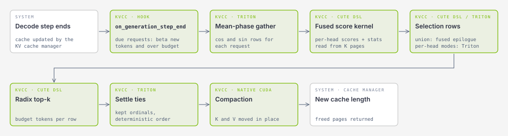
</figure>

<em>Figure 9: One TriAttention eviction round in TensorRT LLM, one box per kernel. The generation-end hook picks the due requests; a Triton kernel gathers the mean-phase rows; the fused CuTe DSL kernel scores every generated token from the K pages; the selection rows are produced in the same kernel for `union` mode and by a Triton reduction for the per-head modes; a CuTe DSL radix top-k and a Triton tie-settling pass choose the kept tokens; a native CUDA kernel compacts K and V; and the cache manager takes the new length and the freed pages.</em>

The method changes the physical cache length but keeps block reuse valid, because it compacts only the generated suffix and preserves the prompt prefix that the cache manager reuses. Decoding runs the model's standard attention kernel over the compacted cache. For calibration, configuration parameters, and current requirements, please refer to the [TriAttention example](https://github.com/NVIDIA/TensorRT-LLM/blob/main/examples/kv_cache_compression/triattention.md).

## Evaluation

This section consolidates performance and accuracy results for the KV cache compression methods supported in TensorRT LLM. Every comparison is against TensorRT LLM's own uncompressed configuration on the same hardware, software build, and serving configuration; only the compression setting differs.

### NVFP4 Cold-Page Compression

Unless otherwise specified, the experiments below use GB300 GPUs, the PyTorch backend, the paged KV cache manager, and block reuse enabled. Before any result was accepted we confirmed that pages were actually compressed during the measured window, using the offload and onboard byte counters on the `/metrics` endpoint and an Nsight Systems trace.

#### Performance

The compression ratio follows from the format. Packed NVFP4 data plus one 8-bit scale per 16 values costs 0.5625 bytes per value, against 2 bytes for FP16 or BF16 and 1 byte for FP8. Figure 10 shows the measured size of one attention KV page off the GPU for four models. The recurrent-state buffers of hybrid models are stored as they are and do not shrink.

<figure>
  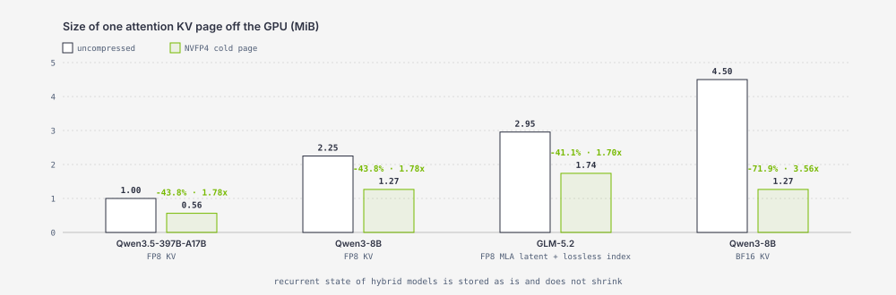
</figure>

<em>Figure 10: Measured size of one attention KV page off the GPU, uncompressed and as an NVFP4 cold page. FP8 pages shrink by 43.75%, BF16 pages by 71.9%; the GLM-5.2 MLA page shrinks a little less because its index buffer stays lossless.</em>

The serving effect of a smaller cold page is more capacity in the host and disk tiers, and therefore a higher prefix-cache hit rate when the working set does not fit. We show it in three settings, from a well-provisioned published configuration to a deliberately GPU-limited one.

**A published configuration.** Figure 11 shows GLM-5.2 at a published InferenceX configuration on 32 GB300s. The uncompressed host tier already reads 96.2% of the prefixes, close to the 97.2% the trace allows, so throughput is neutral. NVFP4 buys latency: P90 interactivity (output tokens per second per user) rises and the P90 time to first token (TTFT) falls.

<figure>
  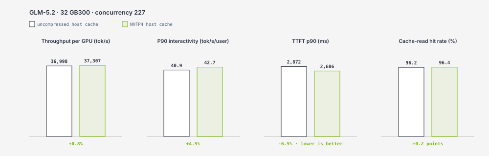
</figure>

<em>Figure 11: GLM-5.2 · published InferenceX configuration · 32 GB300s · AgentX replay. Throughput is unchanged; P90 interactivity and TTFT improve.</em>

**Beyond the published frontier.** When the host tier is under pressure, NVFP4 raises the hit rate, and the serving metrics follow. Figure 12 shows one point from our search: GLM-5.2 at concurrency 288 on 24 GB300s, where the uncompressed tier reads only 90.2% of prefixes. NVFP4 raises that to 95.5%, lifts throughput per GPU by 39.7%, triples P90 interactivity, and cuts TTFT from 38.7 to 6.9 seconds, which puts this configuration on the Pareto frontier.

<figure>
  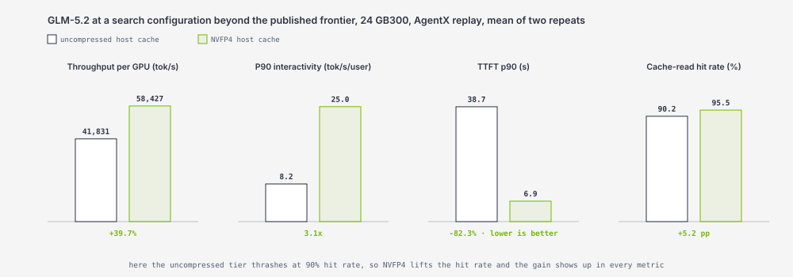
</figure>

<em>Figure 12: GLM-5.2 · 24 GB300s · concurrency 288 · AgentX replay. NVFP4 lifts the cache-read hit rate from 90.2% to 95.5% and improves every serving metric.</em>

**A GPU-limited deployment.** The third setting is a resource-constrained configuration: Qwen3.5-397B-A17B served on ten GB300s (prefill on 2 GPUs, generation on 8 GPUs) at concurrency 192. With the host tier alone the uncompressed setting reads only 57% of prefixes. Figure 13 grows the disk tier from 0 to 1,024 GiB. NVFP4 hits more, completes more, and answers sooner at every disk size. The gain peaks at 512 GiB: 64% more requests completed and 48% sooner.

<figure>
  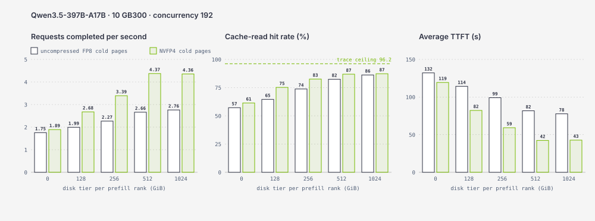
</figure>

<em>Figure 13: Qwen3.5-397B-A17B · ten GB300s · concurrency 192 · growing disk tier. NVFP4 completes more requests, hits more, and answers sooner at every disk size.</em>

#### Accuracy

Cold-page compression is lossy, so the remaining question is how much accuracy it can cost. Two facts bound the answer.

First, a page is quantized only when it leaves the GPU, and at most once per offload. In most deployments the host tier has headroom, so most pages never leave the GPU and are never quantized at all; attention reads them exactly as they were written. Even under heavy cache pressure, only part of the pages that attention reads have been through the codec. The worst case is a deployment where every page is re-quantized on every turn. Even then a page never carries more than one NVFP4 rounding at a time, so the accuracy of cold-page compression is bounded below by that of a fully NVFP4 KV cache, a configuration TensorRT LLM already ships and whose loss is small and well characterized. Every real deployment sits strictly inside that bound.

Second, repeated quantize-and-dequantize round trips do not compound. A value can move on the first round trip, in rare cases once more on the second, and never after that. We measure this as a distance. For a value with original x0 and value xr after r round trips, in a block whose original maximum is m, the distance to the original is |xr - x0| / m and the distance to the previous round trip is |xr - x(r-1)| / m. Figure 14 reports both over every finite FP8 code and every FP16 and BF16 value whose block scale is a normal E4M3 code. The distance to the original is the quantization error itself, a median below 1% of the block maximum and a worst case of 17%, and it is the same after every round trip. The distance to the previous round trip is zero for every value from the second round trip on. End to end, Qwen3-8B on AIME24 and AIME25 loses about 2 points after one round trip, within the noise of this setup, and the second round trip reproduces every output of the first.

<figure>
  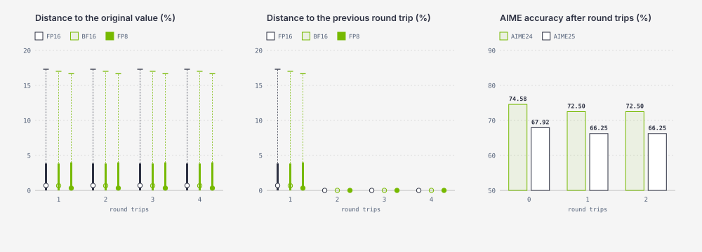
</figure>

<em>Figure 14: NVFP4 round trips do not accumulate error. Left: distance to the original value after 1 to 4 round trips, as a percentage of the block maximum, for every finite FP8 code and every FP16 and BF16 value with a normal block scale; the dot is the median, the bar reaches the 90th percentile, the tick is the maximum. The distribution is the quantization error, and it does not change with the number of round trips. Middle: distance to the previous round trip; from the second round trip on it is zero for every value. The one exception is the exhaustive FP8 layout that lays all 254 codes out in order, where 18 of 1,024 values move once more at the second round trip and never again. Right: Qwen3-8B accuracy on AIME24 and AIME25 (30 questions, 8 seeds) after 0, 1 and 2 round trips; the second round trip reproduces all 480 outputs of the first. Distances come from a scalar reference model of the codec that reproduces the change counts of the production kernels exactly.</em>

Together, these two facts mean that cold-page compression cannot drift with repeated offloading. Its accuracy cost is at most one NVFP4 rounding of the pages that actually leave the GPU, and it does not grow with the number of times a page is offloaded and brought back.

### TriAttention

#### Performance

TriAttention shrinks the decode KV cache of every running sequence, so it helps in two ways: decoding reads a shorter cache at the same batch size, and more sequences fit on the GPU. We measure both on Qwen3-8B on one B200 with 1,024 input and 16,384 output tokens per request, CUDA graphs and the overlap scheduler on, and three fresh-process runs per point on the same GPU. Figure 15 shows aggregate output throughput per GPU against batch size for the dense cache and for TriAttention with budgets of 4,096 and 2,048 tokens and an eviction period equal to the budget.

At matched batch sizes the compacted cache decodes faster: at batch size 32, budget 4,096 gives 27% more output throughput than dense and budget 2,048 gives 60% more. Beyond that the dense cache runs out of memory at batch size 64, while TriAttention keeps scaling: budget 2,048 reaches 6,670 tok/s at batch size 64 and 8,198 tok/s at batch size 128, 2.7x the dense peak on the same GPU.

<figure>
  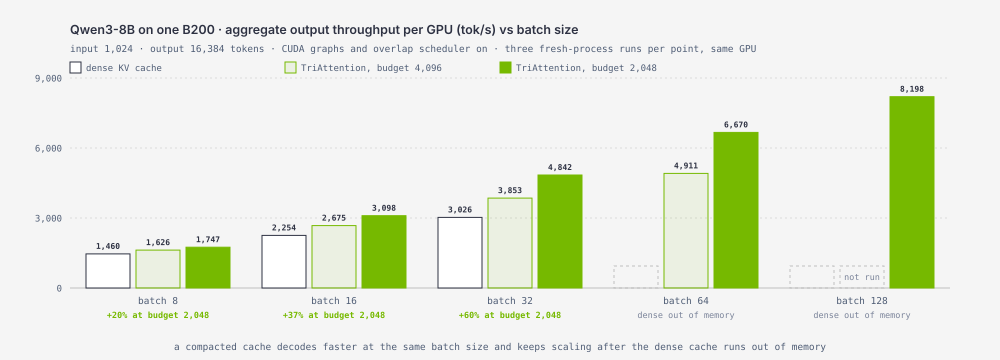
</figure>

<em>Figure 15: TriAttention on Qwen3-8B, one B200, 1,024 input and 16,384 output tokens. Aggregate output throughput per GPU against batch size for the dense KV cache and for TriAttention with budgets of 4,096 and 2,048 tokens. The dense cache runs out of memory at batch size 64; TriAttention continues to batch size 128.</em>

#### Accuracy

Eviction is lossy by design, and the budget sets the trade. Figure 16 shows AIME25 accuracy against the decode KV budget for Qwen3-8B and GPT-OSS-120B in `union` mode, with the dense result as the dashed line. Each point is 30 problems with 4 samples, so single points carry about 4 to 5 points of noise. With aggressive budgets of 1,000 or 2,000 tokens for outputs that run to 32,000 tokens, accuracy drops sharply. At 4,096 tokens, the budget used for the throughput results above, the drop is about 5 points on both models while the decode KV shrinks 7.9 times on Qwen3-8B. From 8,192 tokens on, accuracy is within noise of dense on both models while the decode KV still shrinks 2 to 4 times. The friendly region is therefore wide, and the budget can be chosen per deployment to trade a known amount of accuracy for capacity.

<figure>
  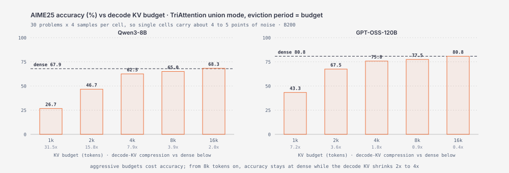
</figure>

<em>Figure 16: AIME25 accuracy against the decode KV budget for TriAttention in union mode with the eviction period equal to the budget, on Qwen3-8B (left) and GPT-OSS-120B (right). The dashed line is the dense cache. The label under each bar is the decode-KV compression relative to dense at that budget.</em>

For configuration, the calibration workflow, and validated modes, please refer to the [TriAttention example](https://github.com/NVIDIA/TensorRT-LLM/blob/main/examples/kv_cache_compression/triattention.md).

## Summary and Future Work

### Current State

The KV cache compression framework, NVFP4 cold-page compression, and TriAttention are in TensorRT LLM today and ready to use. Both methods are turned on with one configuration block and work with the mainstream model families; the tested list is in the [KV Cache Compression feature documentation](https://github.com/NVIDIA/TensorRT-LLM/blob/main/docs/source/features/kv-cache-compression.md#tested-models), and runnable configurations are in the [examples](https://github.com/NVIDIA/TensorRT-LLM/tree/main/examples/kv_cache_compression). The framework is ready to extend: a new method inherits the manager base, plugs into the stages it needs, and brings its own kernels, without changes to the attention kernels, the cache manager, or the serving loop.

### Future Work

The framework is built to grow. We will keep adding compression techniques for the new era of long-context, reasoning and agentic workloads, as the workload and the hardware evolve.

The goals do not change: better use of GPU memory and bandwidth, higher throughput and lower latency, and accuracy that holds on real tasks. New methods will land through the same framework, with the same one-block configuration and no changes to the attention kernels, the cache manager or the serving loop.

## References

- W. Nixon, J. Durbin, F. Standhartinger, H. S. Gunawi, and J. Yang. A Year in LLM Serving: Workload Evolution, Caching and Load-Balancing. [arXiv:2608.13573](https://arxiv.org/abs/2608.13573), 2026.
- W. Mao et al. TriAttention. ICML 2026. [arXiv:2604.04921](https://arxiv.org/abs/2604.04921).
- KVCOMM: Online Cross-context KV-cache Communication for Efficient LLM-based Multi-Agent Systems. NeurIPS 2025. [arXiv:2510.12872](https://arxiv.org/abs/2510.12872).
- RocketKV: Accelerating Long-Context LLM Inference via Two-Stage KV Cache Compression. ICML 2025. [arXiv:2502.14051](https://arxiv.org/abs/2502.14051).
- TensorRT LLM, [KV Cache Compression feature documentation](https://github.com/NVIDIA/TensorRT-LLM/blob/main/docs/source/features/kv-cache-compression.md) and [examples](https://github.com/NVIDIA/TensorRT-LLM/tree/main/examples/kv_cache_compression).
